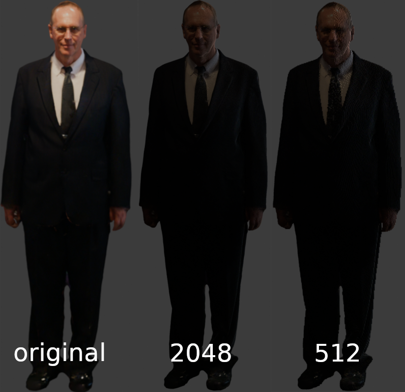

# MeshToVox
A Command line ultility to convert triangle meshes into voxels.

## Cli Usage
Program Arguments:
    * `--f string <input path>`: **(required)** Supported Formats : glb/gltf\
    * `--o string <output path>`:  **(required)** Supported Formats : .gltf, .vox\
    * `--dim int <size of voxel grid>`:  **(default: 1022)**\
    * `--timer bool`:  **(default: false)** Outputs profiling imformation\
    * `--sparse bool`:  **(default: true)** Removes non visible voxel faces ie inside of a sphere. Compatible with all meshes. Ignored for vox file format. Significantly reduces file size but takes more time and memory.

## Installation
[Cargo](https://www.rust-lang.org/tools/install 'Cargo') is requried for installation.\
You can either install with `cargo install mesh_to_vox`. Or clone the repo and run with `cargo run --release -- (your argument)`

## Examples:
`cargo install mesh_to_vox;
mesh_to_vox -- --f data/original/person.glb --o data/test_gltf/test.gltf --dim 2048 --sparse true`

## Todo
 * Multi-Threading / Gpu support
 * Directed cycle graph output format
 * Normals
